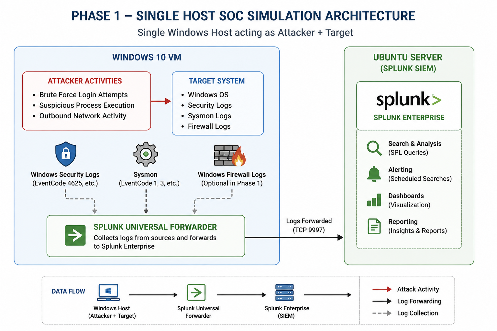

# Phase 1 — Single Host SOC Simulation Architecture

## 🏗️ Overview

This phase represents a **controlled SOC simulation environment** where all attack activities and monitoring occur within a single Windows system.

The objective of this phase is to validate:
- Log ingestion into Splunk
- Detection logic using SPL
- Alert configuration
- Dashboard visualization

---

## 📊 Architecture Diagram

---

## 🧩 Components

### 🔹 Windows 10 Virtual Machine

This machine performs dual roles:

- **Attacker**
  - Simulates brute-force attempts
  - Executes suspicious commands (PowerShell, system enumeration)
  - Generates outbound network activity

- **Target System**
  - Generates Windows Security Logs
  - Produces Sysmon telemetry

---

### 🔹 Sysmon

Installed on the Windows system to capture:

- Process creation (EventCode 1)
- Network activity (EventCode 3)

---

### 🔹 Splunk Universal Forwarder

- Installed on Windows VM
- Collects:
  - Windows Security Logs
  - Sysmon logs
- Forwards logs to Splunk SIEM

---

### 🔹 Ubuntu Server (Splunk SIEM)

- Hosts Splunk Enterprise
- Receives logs from Windows
- Used for:
  - Detection engineering
  - Alerting
  - Dashboard creation

---

## 🔄 Data Flow
Windows (Attacker + Target)
↓
Splunk Universal Forwarder
↓
Splunk SIEM (Ubuntu Server)

---

## 🎯 Purpose of Phase 1

- Establish baseline SOC capabilities
- Validate detection queries
- Build initial dashboards and alerts
- Understand log behavior in a controlled environment

---

## ⚠️ Limitation

- Attacker and target are the same system
- No true external threat simulation
- Network visibility is limited to internal activity

---
