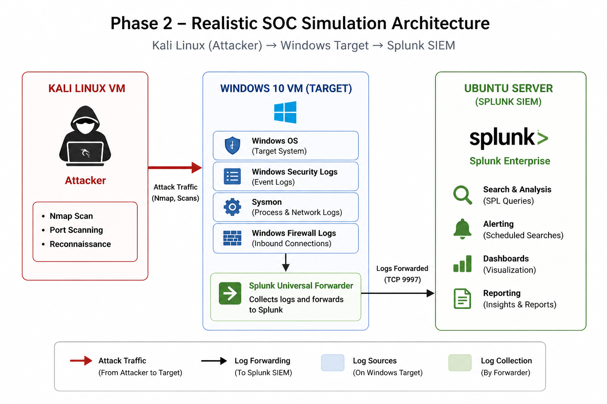

# Phase 2 — Realistic SOC Simulation Architecture

## 🏗️ Overview

This phase extends the lab into a **multi-machine SOC environment**, introducing a dedicated attacker system to simulate real-world external threats.

The objective of this phase is to:
- Simulate external attacks
- Capture inbound network activity
- Improve detection realism

---

## 📊 Architecture Diagram

---

## 🧩 Components

### 🔹 Kali Linux Virtual Machine

- Acts as the **external attacker**
- Used to perform:
  - Network reconnaissance (Nmap scan)
  - Port scanning
  - Connection attempts

---

### 🔹 Windows 10 Virtual Machine

- Acts as the **target system**
- Generates:
  - Windows Security Logs
  - Sysmon logs
  - Windows Firewall logs

---

### 🔹 Windows Firewall Logging

- Enabled to capture inbound network activity
- Provides visibility into:
  - External attacker IP (Kali)
  - Port scan behavior
  - Allowed/Dropped connections

---

### 🔹 Splunk Universal Forwarder

- Installed on Windows
- Collects:
  - Security logs
  - Sysmon logs
  - Firewall logs
- Forwards logs to Splunk SIEM

---

### 🔹 Ubuntu Server (Splunk SIEM)

- Central log analysis platform
- Used for:
  - Detecting attacks using SPL
  - Creating alerts
  - Building dashboards

---

## 🔄 Data Flow
Kali Linux (Attacker) → Windows Target (Logs Generated) → Splunk Universal Forwarder → Splunk SIEM (Ubuntu Server)

---

## 🎯 Key Improvements from Phase 1

- Introduction of **external attacker (Kali)**
- Realistic network-based attack simulation
- Ability to detect attacker IP
- Enhanced detection using firewall logs

---

## 🔍 Detection Capability

This phase enables detection of:

- Network reconnaissance (Nmap scans)
- External connection attempts
- Port scanning behavior

---

## 🧠 Real-World Relevance

This architecture closely resembles a real SOC environment where:

- Attackers operate from external systems
- Logs are centralized in SIEM
- Analysts monitor and respond to threats

---
