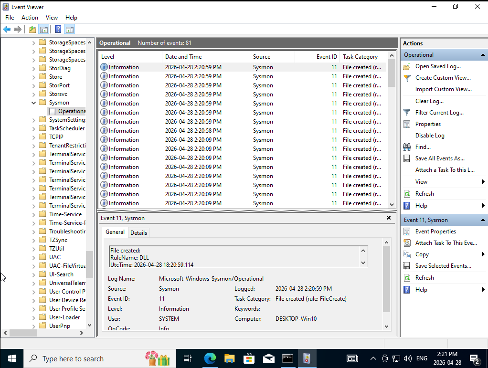
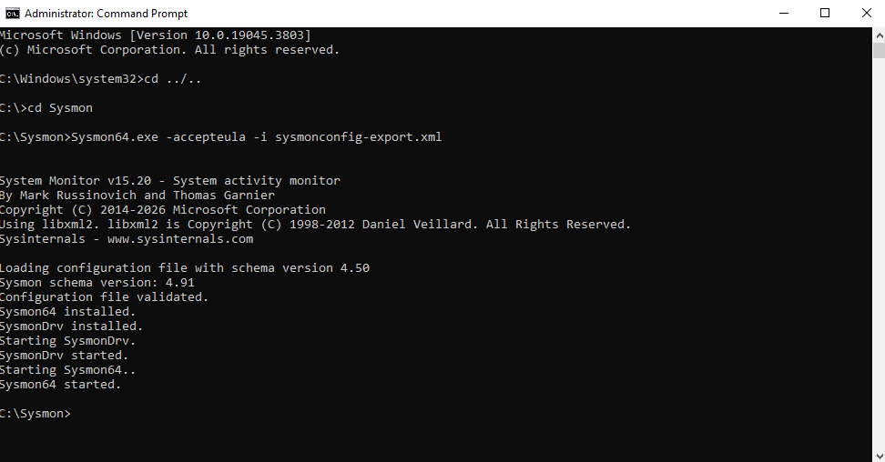

# Sysmon Notes

## 🏗️ Overview

Sysmon (System Monitor) was installed on the Windows machine to provide enhanced endpoint telemetry for security monitoring and detection. Sysmon generates detailed Windows event logs related to process activity, network connections, driver loading, and other system behavior that are not fully available through standard Windows logging alone.

Within this SOC lab project, Sysmon was used as a primary telemetry source for detecting suspicious process execution and outbound network activity.

---

## 📊 Event IDs Used

### 🔹 Event ID 1 — Process Creation

Event ID 1 logs process creation activity, including:

- Process name
- Parent process
- Command-line arguments
- Execution time

This event was used to detect:

- Suspicious PowerShell execution
- Encoded or obfuscated commands
- Reconnaissance-related commands
- Parent-child process relationships

Example detections:
- Suspicious Process Execution Detection
- PowerShell Activity Monitoring

---

### 🔹 Event ID 3 — Network Connection

Event ID 3 logs outbound network connections initiated by processes on the system.

Captured details include:

- Source process
- Destination IP address
- Destination port
- Connection timestamp

This event was used to detect:

- Suspicious outbound connections
- PowerShell-generated network activity
- External communication patterns
- Network activity spikes

Example detections:
- Suspicious Outbound Network Connection Detection
- External Connection Monitoring

---

## 🎯 Role in Detection

Sysmon telemetry significantly improved visibility into endpoint activity within the lab environment. By forwarding Sysmon logs into Splunk SIEM, the project was able to:

- Detect suspicious process execution
- Monitor outbound network activity
- Correlate process behavior with network connections
- Build alerts and dashboards based on endpoint telemetry

Sysmon provided richer detection capability compared to relying solely on standard Windows Event Logs.

---

## 🔍 Verification

Sysmon installation and operation were verified using:

- Windows Event Viewer


- Sysmon service status:
  ```
  sc query Sysmon64
  ```


- Splunk searches:
  ```
  index=sysmon_logs
  ```


Successful ingestion of Sysmon logs into Splunk confirmed proper telemetry collection and forwarding.