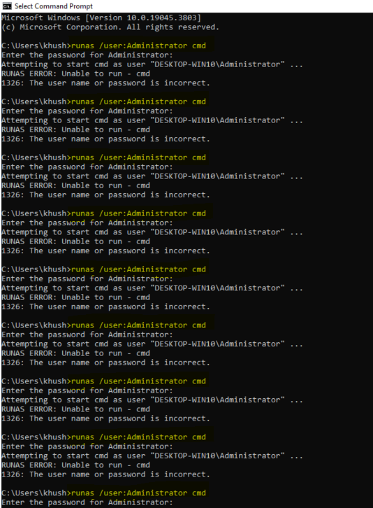
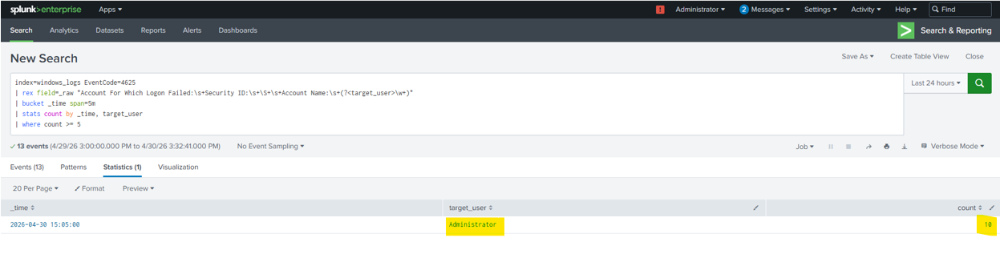
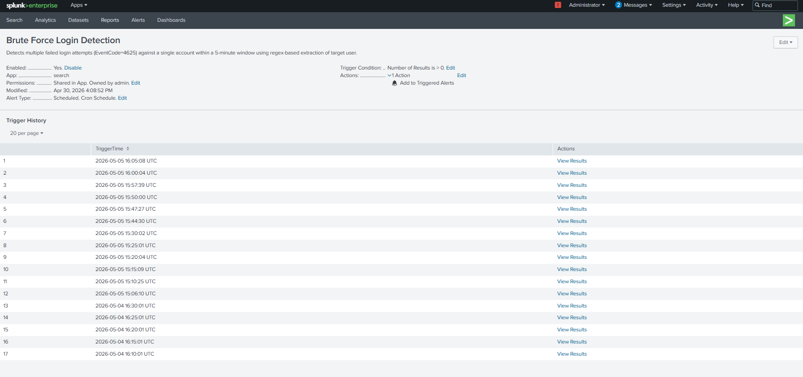
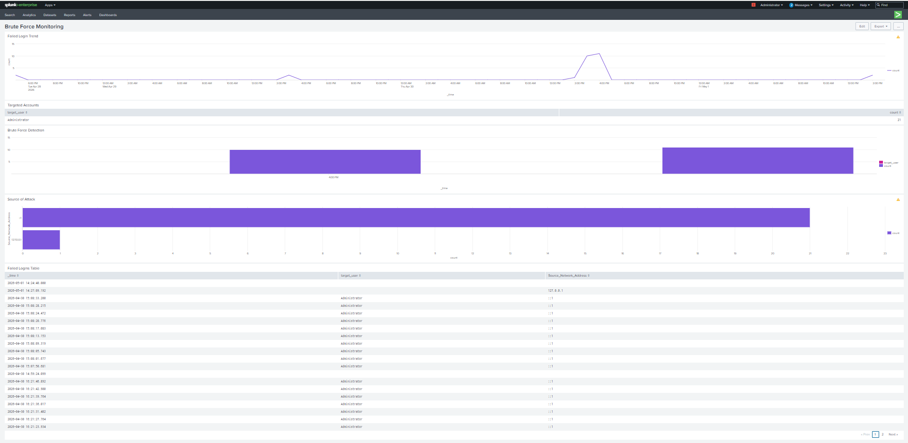

# Brute Force Attack Detection

## 🏗️ Overview

This use case demonstrates the detection of a brute force login attack using Windows Security Logs in Splunk. A brute force attack involves multiple failed login attempts against a user account in a short period of time.

The objective is to identify abnormal authentication behavior and generate alerts for potential unauthorized access attempts.

---

## ⚔️ Attack Simulation

The brute force attack was simulated on the Windows machine by intentionally entering incorrect credentials multiple times for a target account.

- Target account: Administrator
- Multiple failed login attempts were generated within a short time window


---

## 📊 Data Source

The detection is based on:

- Windows Security Logs
- EventCode: 4625 (Failed Login Attempt)

---

## 🧠 Detection Logic

The detection logic focuses on identifying:

- Multiple failed login attempts
- Targeting the same account
- Occurring within a defined time window

If the number of failed login attempts exceeds a threshold within a short duration, it is considered suspicious and flagged as a potential brute force attack.

---

## 🔍 Detection Query
```
index=windows_logs EventCode=4625
| rex field=_raw "Account For Which Logon Failed:\s+Security ID:\s+\S+\s+Account Name:\s+(?<target_user>\w+)"
| bucket _time span=5m
| stats count by _time, target_user
| where count >= 5
```

---

## 📈 Detection Output

The query output displays:

- Time window (_time)
- Targeted account (Account_Name)
- Number of failed login attempts (count)

A high number of failed login attempts within a short time frame indicates a potential brute force attack.



---

## 🚨 Alert Configuration

An alert was configured in Splunk using the above query with the following settings:

- Title: Brute Force Login Detection
- Alert Type: Scheduled [Run on Cron Schedule]
- Schedule: Every 5 minutes [*/5 * * * *]
- Time Range: All time
- Expires: 24 hour(s)
- Trigger Condition: Number of results > 0


---

## 📊 Dashboard Visualization

A dashboard panel was created to visualize:

- Failed login trend
- Targeted accounts
- Brute force detection
- Source of attack
- Failed login table

This helps in quickly identifying abnormal login patterns.



---

## 🔍 Key Observations

- Multiple accounts appeared in the logs (e.g., Administrator and other local users)
- The detection query was refined to focus specifically on the target account (Administrator)
- Threshold tuning helped reduce false positives

---

## 🧠 MITRE ATT&CK Mapping

- Technique: T1110 — Brute Force

---

## 📌 Conclusion

This detection successfully identifies brute force login attempts by analyzing failed authentication events in Windows logs. By combining alerting, and visualization, it enables effective monitoring of authentication-related threats in a SOC environment.