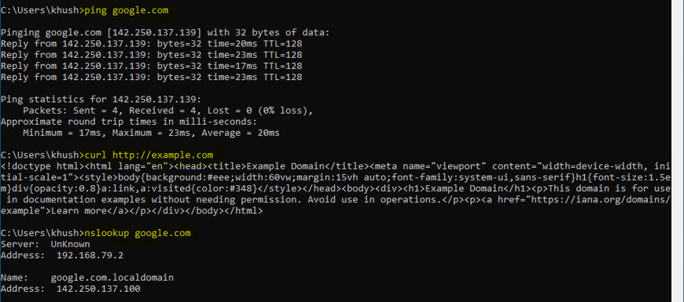
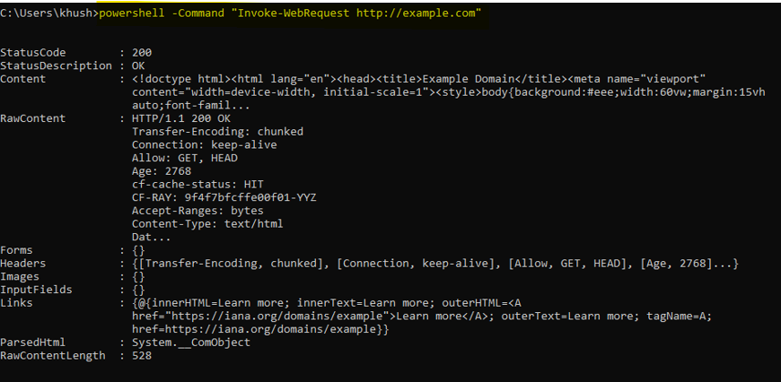
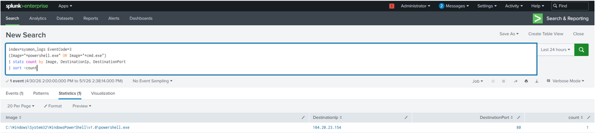
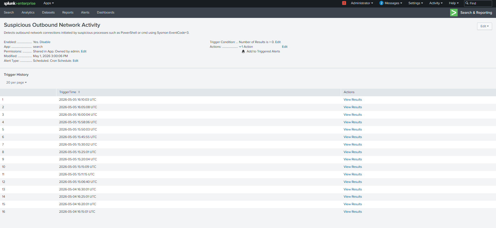
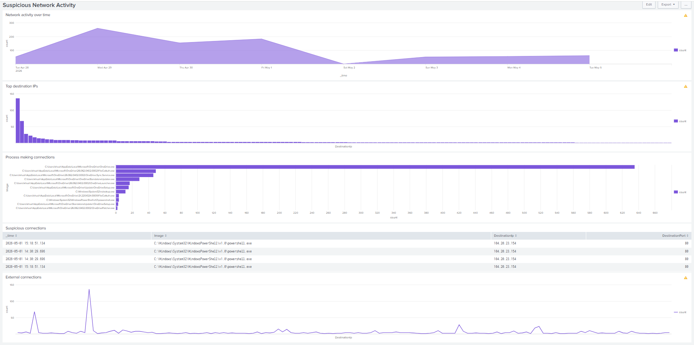

# Outbound Network Activity Detection

## 🏗️ Overview

This use case demonstrates the detection of outbound network activity using Sysmon logs in Splunk. Monitoring outbound connections is important because compromised systems often initiate connections to external hosts for command-and-control communication, data exfiltration, or further attack progression.

The objective is to identify unusual or high-volume outbound network activity from the endpoint.

---

## ⚔️ Attack Simulation

Outbound network activity was simulated on the Windows machine by generating network connections to external systems.

- Initiated multiple outbound connections
- Simulated behavior similar to reconnaissance or external communication





---

## 📊 Data Source

The detection is based on:

- Sysmon Logs
- EventCode: 3 (Network Connection)

---

## 🧠 Detection Logic

The detection logic focuses on identifying:

- Outbound connections from the Windows system
- High volume of connections within a short time window
- Potential spikes in network activity

A sudden increase in outbound connections may indicate suspicious behavior such as scanning or communication with external systems.

---

## 🔍 Detection Query
```
index=sysmon_logs EventCode=3
(Image="*powershell.exe" OR Image="*cmd.exe")
| stats count by Image, DestinationIp, DestinationPort
| sort -count
```

---

## 📈 Detection Output

The query output displays:

- Process initiating the connection (Image)
- Destination IP address (DestinationIp)
- Destination port (DestinationPort)
- Number of connections (count)

This detection highlights outbound network connections initiated by commonly abused processes such as PowerShell and Command Prompt.



Such processes are frequently used by attackers to:

- Execute remote commands
- Perform network reconnaissance
- Communicate with external systems

A high number of connections to different destinations or ports from these processes may indicate suspicious activity and should be investigated further.

## 🚨 Alert Configuration

An alert was configured in Splunk using the above query with the following settings:

- Title: Suspicious Outbound Network Activity 
- Alert Type: Scheduled [Run on Cron Schedule]
- Schedule: Every 5 minutes [*/5 * * * *]
- Time Range: All time
- Expires: 24 hour(s)
- Trigger Condition: Number of results > 0



---

## 📊 Dashboard Visualization

A dashboard panel was created to visualize:

- Network activity over time
- Top destination IPs
- Process making connections
- Suspicious connections (PowerShell)
- External connections only

This helps in identifying unusual network behavior quickly.



---

## 🔍 Key Observations

- Normal system activity generates baseline network connections
- Sudden spikes indicate abnormal or suspicious behavior
- Threshold tuning is important to reduce false positives

---

## 🧠 MITRE ATT&CK Mapping

- Technique: T1046 — Network Service Discovery

---

## 📌 Conclusion

This detection provides visibility into outbound network activity using Sysmon logs. By identifying spikes in connection patterns, it helps detect potential reconnaissance or suspicious external communication from the endpoint.