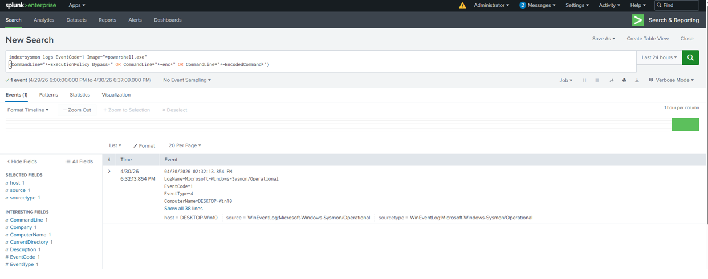
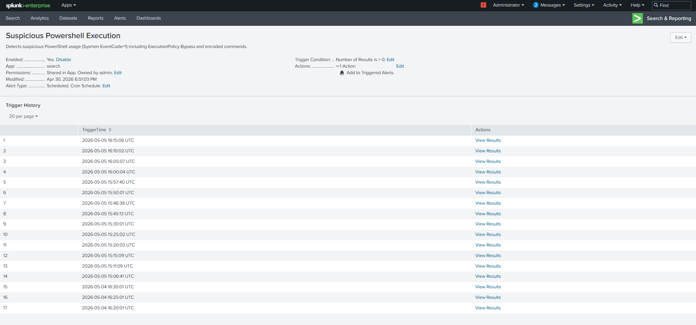
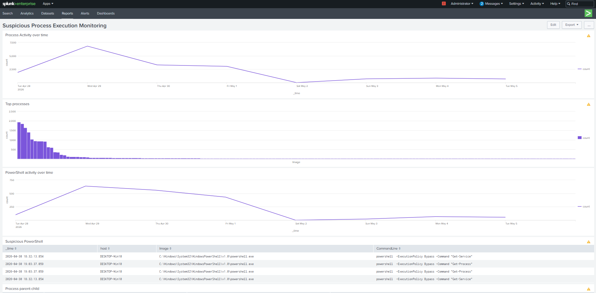
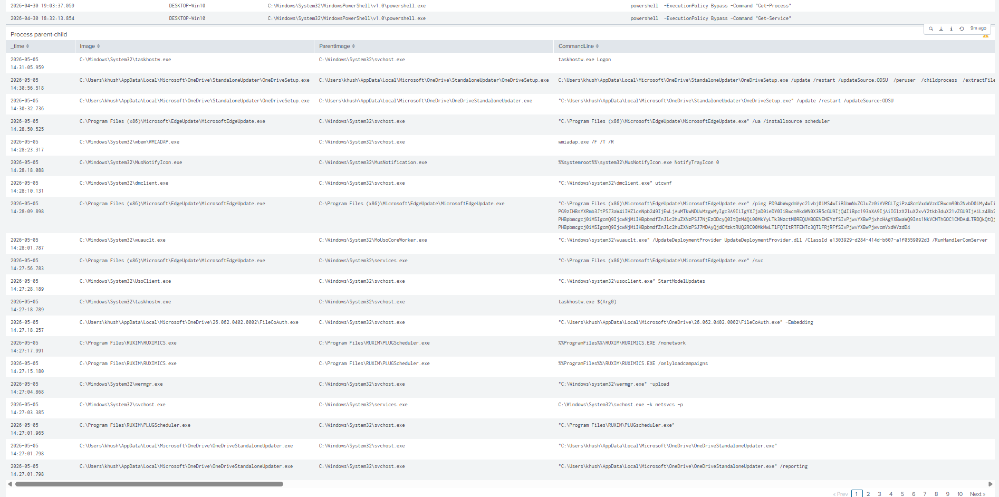

# Suspicious Process Execution Detection

## 🏗️ Overview

This use case demonstrates the detection of suspicious process execution using Sysmon logs in Splunk. Attackers often use command-line tools such as PowerShell or system utilities to perform reconnaissance, execute scripts, or maintain persistence.

The objective is to identify abnormal or potentially malicious process activity on the endpoint.

---

## ⚔️ Attack Simulation

Suspicious process activity was simulated on the Windows machine by executing commands commonly associated with attacker behavior.

- Executed PowerShell commands
- Performed system enumeration activities
- Ran commands that generate visible process creation logs

Commands used to simulate the suspicious process activity:
```
whoami
net user
ipconfig
tasklist
powershell -Command "Get-Process"
powershell -ExecutionPolicy Bypass -Command "Get-Service"
cmd.exe /c dir
```

---

## 📊 Data Source

The detection is based on:

- Sysmon Logs
- EventCode: 1 (Process Creation)

---

## 🧠 Detection Logic

The detection logic focuses on identifying:

- Execution of suspicious processes (e.g., PowerShell, cmd)
- Unusual or uncommon command-line activity
- High frequency of process creation events

Processes such as PowerShell are commonly abused by attackers for executing malicious scripts and commands.

---

## 🔍 Detection Query
```
index=sysmon_logs EventCode=1 Image="*powershell.exe"
(CommandLine="*-ExecutionPolicy Bypass*" OR CommandLine="*-enc*" OR CommandLine="*-EncodedCommand*")
```

---

## 📈 Detection Output

This detection highlights PowerShell executions that use suspicious flags such as:

- ExecutionPolicy Bypass
- Encoded commands (-enc, -EncodedCommand)

These indicators are commonly associated with malicious activity, as attackers often use them to bypass security controls and execute obfuscated scripts.


---

## 🚨 Alert Configuration

An alert was configured in Splunk using the above query with the following settings:

- Title: Suspicious Process Execution Detection
- Alert Type: Scheduled [Run on Cron Schedule]
- Schedule: Every 5 minutes [*/5 * * * *]
- Time Range: All time
- Expires: 24 hour(s)
- Trigger Condition: Number of results > 0



---

## 📊 Dashboard Visualization

A dashboard panel was created to visualize:

- Process execution activity over time
- Top processes
- Powershell activity over time
- Suspicious PowerShell
- Process parent-child context

This helps in identifying abnormal spikes in process execution.





---

## 🔍 Key Observations

- PowerShell was identified as a high-risk process due to its flexibility and frequent use in attacks
- Command-line arguments provide critical context for investigation
- Filtering specific processes helps reduce noise and focus on relevant activity

---

## 🧠 MITRE ATT&CK Mapping

- Technique: T1059.001 — Command and Scripting Interpreter: PowerShell

---

## 📌 Conclusion

This detection enables monitoring of suspicious process execution by leveraging Sysmon logs. By analyzing process creation events and command-line activity, it provides visibility into potentially malicious behavior on the endpoint.