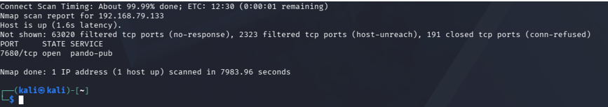
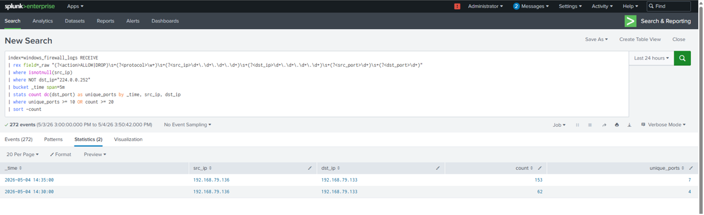
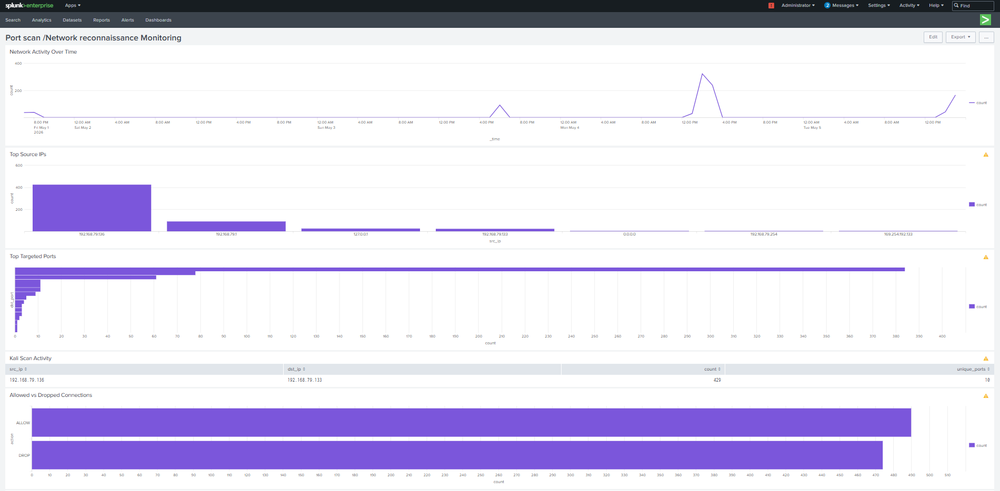
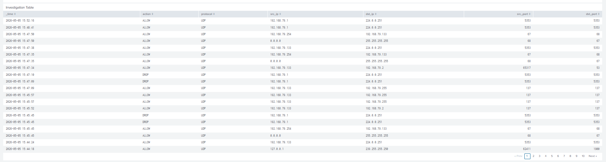

# Network Reconnaissance Detection (Kali Attack)

## 🏗️ Overview

This use case demonstrates the detection of network reconnaissance activity performed from an external attacker system (Kali Linux) against a Windows target. Network reconnaissance typically involves scanning ports and services to identify potential entry points into a system.

The objective is to detect external scanning activity by identifying abnormal connection patterns using Windows Firewall logs in Splunk.

---

## ⚔️ Attack Simulation

The attack was simulated using Kali Linux to perform a network scan against the Windows machine.

- Tool used: Nmap
- Target: Windows machine
- Command used:
  ```
  sudo nmap -sT -p- -Pn <windows_ip>
  ```



This generated multiple connection attempts from Kali to the Windows system across different ports.

---

## 📊 Data Source

The detection is based on:

- Windows Firewall Logs
- Log file: pfirewall.log
- Index: windows_firewall_logs

---

## 🧠 Detection Logic

The detection logic focuses on identifying:

- A single external source IP
- Connecting to multiple destination ports
- High number of connection attempts in a short time window

Such behavior is a strong indicator of network reconnaissance or port scanning activity.

---

## 🔍 Detection Query
```
index=windows_firewall_logs RECEIVE
| rex field=_raw "(?<action>ALLOW|DROP)\s+(?<protocol>\w+)\s+(?<src_ip>\d+\.\d+\.\d+\.\d+)\s+(?<dst_ip>\d+\.\d+\.\d+\.\d+)\s+(?<src_port>\d+)\s+(?<dst_port>\d+)"
| where isnotnull(src_ip)
| where NOT dst_ip="224.0.0.252"
| bucket _time span=5m
| stats count dc(dst_port) as unique_ports by _time, src_ip, dst_ip
| where unique_ports >= 10 OR count >= 20
| sort -count
```

---

## 📈 Detection Output

The query output displays:

- Time window (_time)
- Source IP address (src_ip)
- Destination IP address (dst_ip)
- Number of connections (count)
- Number of unique destination ports targeted (unique_ports)

This detection identifies systems generating a high number of connection attempts across multiple ports within a short time window.

The filtering of multicast traffic (`224.0.0.252`) helps reduce background noise from normal Windows network activity such as LLMNR traffic.

A high number of unique destination ports targeted by a single source IP is a strong indicator of network reconnaissance or port scanning activity.


---

## 🚨 Alert Configuration

An alert was configured in Splunk using the above query with the following settings:

- Title: Port scan/Network Reconnaissance Detection
- Alert Type: Scheduled [Run on Cron Schedule]
- Schedule: Every 5 minutes [*/5 * * * *]
- Time Range: All time
- Expires: 24 hour(s)
- Trigger Condition: Number of results > 0


---

## 📊 Dashboard Visualization

A dashboard panel was created to visualize:

- Network activity over time
- Top source IPs
- Top targeted ports
- Kali scan activity
- Allowed vs dropped connections
- investigation table

This helps in quickly identifying scanning behavior from external systems.





---

## 🔍 Key Observations

- The Kali machine IP appeared as the source of multiple connection attempts
- A large number of ports were targeted within a short time window
- Firewall logs provided visibility into external attacker activity, which was not captured by Sysmon alone

---

## 🧠 MITRE ATT&CK Mapping

- Technique: T1046 — Network Service Discovery

---

## 📌 Conclusion

This detection successfully identifies network reconnaissance activity performed by an external attacker. By analyzing firewall logs and identifying abnormal connection patterns, it provides visibility into port scanning behavior and enhances network-level threat detection within the SOC environment.