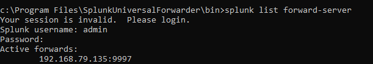
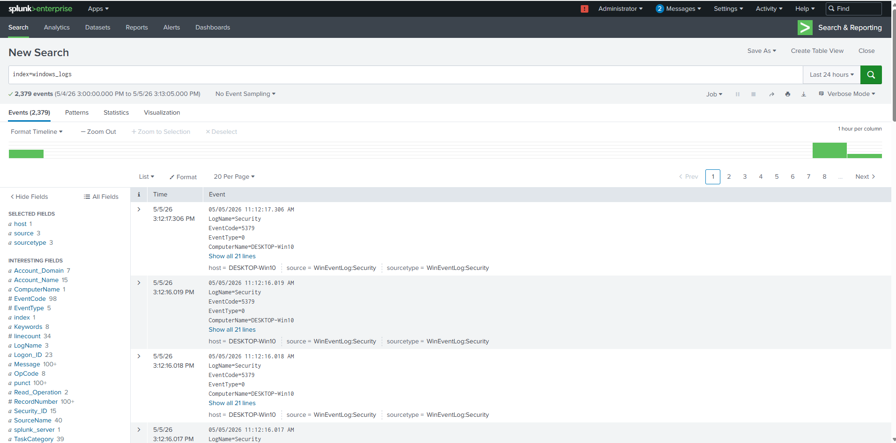
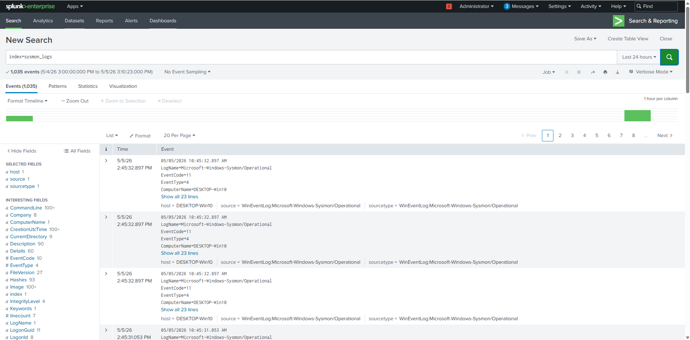
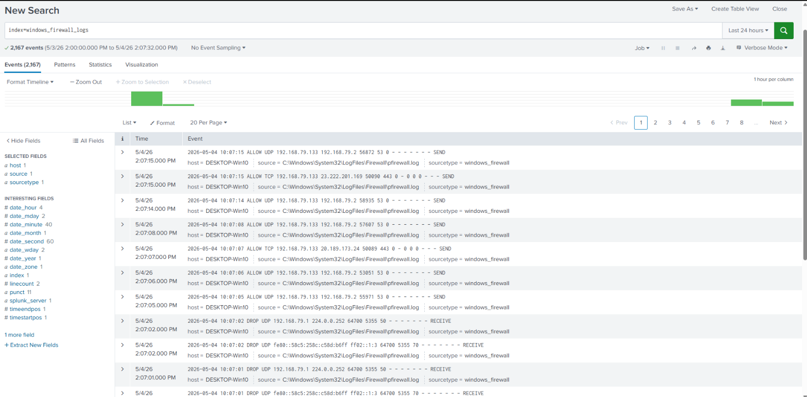

# Phase 2 — Environment Setup

## 🏗️ Overview

This phase extends the lab into a multi-machine SOC simulation environment by introducing a dedicated attacker system. Kali Linux is used to simulate real-world external attacks against a Windows target, while Splunk SIEM is used for monitoring, detection, and alerting.

For architecture details, refer to:
[Phase 2 Architecture](../architecture/phase-2-architecture.md)

---

## 🖥️ Virtual Machines

### Kali Linux VM
- Role: Attacker
- Used to perform:
  - Network reconnaissance (Nmap scans)
  - Port scanning
  - Connection attempts against the target system

---

### Windows 10 VM
- Role: Target System
- Generates:
  - Windows Security Logs
  - Sysmon logs
  - Windows Firewall logs
- Installed components:
  - Sysmon
  - Splunk Universal Forwarder

---

### Ubuntu Server VM
- Role: SIEM Server
- Installed component:
  - Splunk Enterprise

---

## ⚙️ Splunk Enterprise Setup (Ubuntu)

- Splunk Enterprise is installed and running
- Accessed via:
  http://<ubuntu_ip>:8000
- Receiving port configured:
  9997 (Splunk Forwarder Port)

---

## 🔄 Splunk Universal Forwarder Setup (Windows)

- Splunk Universal Forwarder is installed on Windows
- Configured to forward logs to:
  <ubuntu_ip>:9997

---

## 📊 Log Sources Configuration

### Windows Event Logs
- Security
- System
- Application

---

### Sysmon Logs
- EventCode 1 → Process Creation
- EventCode 3 → Network Connections

---

### Windows Firewall Logs
- Enabled to capture inbound and outbound network activity
- Used to detect external attacker activity (Kali)

---

## 📝 inputs.conf Configuration

The following configuration was used on the Windows machine:
```
[WinEventLog://Security]
disabled = false
index = windows_logs

[WinEventLog://System]
disabled = false
index = windows_logs

[WinEventLog://Application]
disabled = false
index = windows_logs

[WinEventLog://Microsoft-Windows-Sysmon/Operational]
disabled = false
index = sysmon_logs
start_from = oldest
current_only = 0

[monitor://C:\Windows\System32\LogFiles\Firewall\pfirewall.log]
disabled = false
index = windows_firewall_logs
sourcetype = windows_firewall
```
---

## 🌐 Network Configuration

- All virtual machines are connected on the same network (NAT or Host-Only)
- Verified connectivity between machines:
  - Kali → Windows
  - Windows → Kali
  - Kali → Ubuntu

---

## 🔍 Verification

The setup was verified using the following checks:

- Confirm forwarder connection:
  ```
  splunk list forward-server
  ```
  

- Verify Windows logs ingestion:
  ```
  index=windows_logs
  ```
  

- Verify Sysmon logs ingestion:
  ```
  index=sysmon_logs
  ```
  

- Verify Firewall logs ingestion:
  ```
  index=windows_firewall_logs
  ```
  

Successful log ingestion confirms that the environment is ready for attack simulation and detection.

---